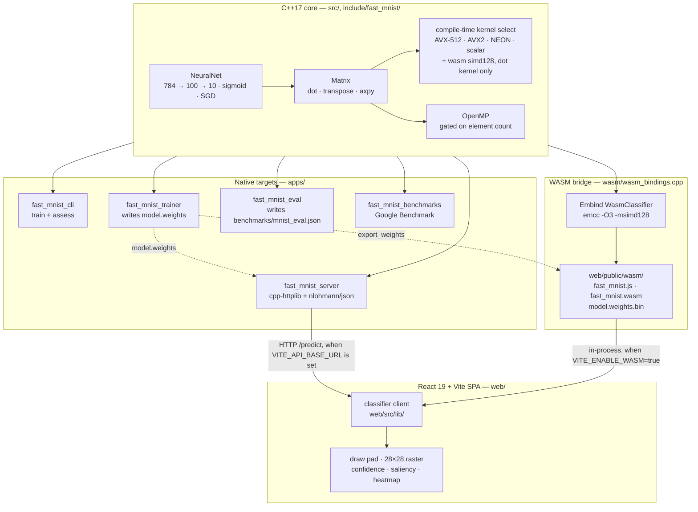

<p align="center">
  
  
</p>

<h1 align="center">Glyph</h1>

<p align="center">
  <strong>A course-provided C++ MNIST network, hand-optimized — the dot-product
  hot loop rewritten four times in AVX-512, AVX2, NEON and wasm simd128 over a
  scalar fallback, behind a 97.01% classifier, with a scalar-vs-optimized race
  that runs in your browser.</strong>
</p>

<p align="center">
  <a href="https://getglyph.vercel.app"><strong>Live App</strong></a> ·
  <a href="https://getglyph.vercel.app/system-card"><strong>System Card</strong></a> ·
  <a href="#architecture">Architecture</a> ·
  <a href="#benchmarks">Benchmarks</a> ·
  <a href="#implemented-vs-delegated-vs-planned">What is mine</a> ·
  <a href="#getting-started">Getting Started</a> ·
  <a href="#verify-it">Verify it</a>
</p>

[![ci][ci-badge]][ci-url]
[![license][license-badge]][license-url]
[![release][release-badge]][release-url]
[![web app][web-badge]][web-url]
[![system card][systemcard-badge]][systemcard-url]
[![openssf scorecard][scorecard-badge]][scorecard-url]

Glyph runs in your browser at [getglyph.vercel.app](https://getglyph.vercel.app);
the model, its limits, and its measured numbers are on the
[System Card](https://getglyph.vercel.app/system-card). Glyph is one of six
projects presented together at
[yadava5.github.io/Portfolio-2.0](https://yadava5.github.io/Portfolio-2.0/).

---

## Overview

The network came with a course. A C++ multilayer perceptron, 784 → 100 → 10,
two sigmoid layers, backpropagation with Xavier initialization and plain SGD —
correct, and entirely scalar. Every dot product in the forward pass walks one
weight at a time while the rest of the CPU's vector lanes sit idle. Glyph is
what happens when you keep that network exactly as it was and rewrite only the
inner reduction.

`Matrix::dot`, `Matrix::transpose` and `Matrix::axpy` are hand-written with
AVX-512, AVX2 and NEON intrinsics over a scalar fallback (`src/Matrix.cpp` —
three instruction sets). The fused `sigmoid(Wx + b)` row-vector dot in
`src/NeuralNet.cpp`, which is the actual forward-pass hot loop, carries a fourth
kernel on top of those three: WebAssembly simd128. So "four instruction sets" is
a claim about the dot kernels specifically, not about every primitive. All of it
is selected by `#if` at compile time, with OpenMP above empirically-tuned
element-count thresholds. The same core ships
three ways: a CLI and an HTTP server natively, and an Emscripten build that runs
the identical kernels in the browser. The frontend is a Vite-bundled React 19 +
TypeScript SPA — monochrome, WebGL-free, with the live classifier as the fold
visual.

### Why it's interesting

- **The starting point is not mine, and that is the whole point.** The MLP,
  backprop and training loop arrived as coursework. What is mine is the kernel
  work, the build system, the measurement discipline and the entire web app —
  see [Implemented vs delegated vs planned](#implemented-vs-delegated-vs-planned)
  for the line-by-line split.
- **97.01% on the 10,000-image MNIST test set** — 9,701 correct, macro-F1
  0.9698, regenerable into `benchmarks/mnist_eval.json`, which pins the exact
  model by SHA-256. Read it as a **best-of-epochs number, not a clean held-out
  estimate**: this repository ships no validation split, and
  `apps/train_model.cpp` assesses the network on this same test set after every
  epoch and overwrites the checkpoint only when that score improves. So the set
  that reports the figure also chose the weights being reported on — the honest
  reading is that 97.01% is the best epoch, and a genuinely unseen set would be
  expected to read slightly lower.
- **3.536× on the headline kernel — and the same change loses in 8 of the 12
  matrix-op cases.** `dot 256` with OpenMP + `-march=native` against the same
  kernel built without either, on the same machine. `axpy` never crosses over at
  any benchmarked size, and `transpose 128` is a 7.9× regression. Every one of
  those is in the table below, unhidden.
- **The browser races the scalar path live.** `wasm/wasm_bindings.cpp` times the
  simd128 forward pass against the same math with `#pragma clang loop
  vectorize(disable)`, on your machine, and returns both numbers.
- **The committed WASM glue is byte-compared against a rebuild in CI.** An
  unpinned local toolchain once shipped glue that reached `new Function`, which
  the site's CSP forbids — every visitor silently got the JS fallback while the
  badge stayed green. `.github/workflows/wasm.yml` now fails on drift and on any
  `eval(` in the glue.

---

## Features

### Web demo

**Live: https://getglyph.vercel.app** — draw a digit and the WebAssembly build
reads it, on your machine, with no server.


Draw a digit, load the sample through the command palette (`Cmd+K` / `Ctrl+K`),
and inspect real per-class confidence, activation heatmaps and input saliency —
the panels read `hidden_activations` and `input_grad` off the classifier
response, they are not decorative. Drawing uses perfect-freehand over an SVG
canvas with MNIST-style preprocessing (bounding-box crop, 20×20 fit,
center-of-mass centering) before inference.

The app resolves a classifier in three steps, and labels which one it got:

| Order | Path | Condition |
| ----- | ---- | --------- |
| 1 | Native C++ `/predict` | only when `VITE_API_BASE_URL` is set |
| 2 | Browser WASM (`web/public/wasm/`) | only when `VITE_ENABLE_WASM=true` |
| 3 | Browser JS demo classifier | fallback, labeled as such in the UI |

Both the native and the WASM paths report a scalar baseline alongside the
optimized timing, so the race is real on either. The JS fallback does not, and
says so — `web/src/lib/wasmClassifier.ts` logs once per session when it lands
there rather than failing silently.

One difference worth naming: the native server exponentiates and normalizes the
output layer into a softmax distribution (`apps/server.cpp:227`), while the WASM
path deliberately normalizes without exponentiating (`wasm/wasm_bindings.cpp:218`).
The predicted label is the same; the confidence bars are not on the same scale.

### HTTP API

| Method | Endpoint   | Description                                             |
| ------ | ---------- | ------------------------------------------------------- |
| GET    | `/health`  | Readiness, model path, model-loaded state, topology     |
| POST   | `/predict` | Classify a digit — `{ "pixels": [784 floats in 0..1] }` |

`/predict` returns the predicted label, the confidence distribution, hidden
activations, the input-gradient saliency map, and `baseline_time_ms` /
`optimized_time_ms` from the scalar-vs-optimized race. Missing model files are
startup errors; request validation returns stable JSON errors shaped as
`{ "error": { "code": "...", "message": "..." } }`.

---

## Architecture



### The one hard decision: compile-time selection, not runtime dispatch

Which kernel runs is decided by the preprocessor, not by `cpuid` at startup.
`src/NeuralNet.cpp` opens with a chain of `#if defined(__AVX512F__) / __AVX2__ /
__ARM_NEON__ / __wasm_simd128__` and compiles exactly one. There is no runtime
dispatch anywhere in the library.

That buys readability — the hot path is a couple of hundred lines a reviewer can
audit in one sitting — and it costs portability of a single binary: a build made
on an AVX-512 host will not run on a machine without it, and a generic x86-64
build never reaches the AVX-512 path however capable the host is. It also has a
measurement consequence that took a while to notice. On Apple silicon,
`-march=native` is a flag clang does not act on, so the `baseline` and `native`
binaries come out byte-identical (same md5) and the baseline-to-native column in
any arm64 benchmark table is run-to-run noise, not a measurement of intrinsics
versus the autovectorizer. That is why the tables below compare `baseline`
against `openmp+native` and not against `native`.

The alternative — linking OpenBLAS or vendoring Eigen — is documented and
rejected in
[`docs/adr/0001-hand-rolled-simd-over-bundled-blas.md`](docs/adr/0001-hand-rolled-simd-over-bundled-blas.md),
including the part where OpenBLAS would win large `dot` by roughly 2–3×.

---

## Tech Stack

### Core

| Category | Technologies |
| -------- | ------------ |
| **Language** | C++17 (`target_compile_features(fast_mnist PUBLIC cxx_std_17)`) |
| **Build** | CMake ≥ 3.20, Release by default |
| **SIMD** | AVX-512F / AVX2 (`immintrin.h`), NEON (`arm_neon.h`) across `Matrix` and `NeuralNet`; wasm simd128 (`wasm_simd128.h`) in the `NeuralNet` dot kernel |
| **Parallelism** | OpenMP, gated on element count |
| **HTTP** | cpp-httplib + nlohmann/json, vendored in `third_party/` |
| **Tests** | Catch2 v3.5.2 + rapidcheck (pinned commit `b96a4e6`) |
| **Benchmarks** | Google Benchmark v1.9.1 |
| **WASM** | Emscripten 3.1.64 (pinned in `.github/workflows/wasm.yml`), Embind, `-msimd128` |

### Web

| Category | Technologies |
| -------- | ------------ |
| **Framework** | React 19.2, TypeScript 6.0, Vite 7 (`npm:rolldown-vite@7.2.5`) |
| **Styling** | Tailwind CSS v4.2 tokens, self-hosted Geist / Geist Mono / Instrument Serif |
| **Motion** | Motion v12.38 |
| **Drawing** | perfect-freehand 1.2 over an SVG canvas |
| **E2E** | Playwright 1.59 |

The landing page ships no WebGL. `web/scripts/check-bundle-budget.mjs` holds the
entry chunk to 460 KiB raw / 150 KiB gzip and fails the build if a `three-vendor`
chunk ever reappears. `three` and `@react-three/*` are still in `package.json`
and still back `web/src/components/NeuralNetHero.*`, but nothing imports that
component into the routed app — it is dead code the budget check keeps dead.

---

## Benchmarks

Full methodology, scaling charts and the December history live in
[`BENCHMARKS.md`](BENCHMARKS.md). Every ratio below is
**`openmp+native` against `baseline`: the same kernel, same source, same
machine, built once with OpenMP and `-march=native` and once with neither.**

**Reference machine** — Apple MacBook Pro `MacBookPro18,3`, M1 Pro (arm64),
8 performance + 2 efficiency cores, 16 GiB, macOS 26.6, Apple clang 21.0.0,
CMake 4.2.1, Google Benchmark v1.9.1. Recorded 2026-08-02, full conditions in
[`docs/benchmarks/ENVIRONMENT.md`](docs/benchmarks/ENVIRONMENT.md), which also
states what was *not* controlled (no CPU pinning, no DVFS lock, `load_avg`
9.80 at the start of the run).

Medians of **10 repetitions**, from
`docs/benchmarks/runs/bench-20260802-aggregated-{baseline,openmp-native}.json`:

| Case | baseline | openmp+native | speedup |
| ---- | -------: | ------------: | ------: |
| `dot 32` | 6,400 ns | 6,490 ns | 0.99× |
| `dot 64` | 56,802 ns | 120,385 ns | **0.47×** |
| `dot 128` | 610,624 ns | 406,370 ns | 1.50× |
| **`dot 256`** | **4,897,084 ns** | **1,371,684 ns** | **3.57×** |
| `transpose 128` | 5,720 ns | 44,968 ns | **0.13×** |
| `transpose 256` | 23,615 ns | 56,503 ns | **0.42×** |
| `transpose 512` | 112,173 ns | 79,477 ns | 1.41× |
| `transpose 1024` | 876,147 ns | 223,513 ns | 3.92× |
| `axpy 128` | 3,763 ns | 40,364 ns | **0.09×** |
| `axpy 256` | 14,920 ns | 49,398 ns | **0.30×** |
| `axpy 512` | 60,557 ns | 68,558 ns | **0.88×** |
| `axpy 1024` | 273,175 ns | 296,140 ns | **0.92×** |
| `learn` | 44,040 img/s | 43,937 img/s | **0.998×** |
| `classify` | 70,295 img/s | 69,957 img/s | **0.995×** |

Matrix ops are ns/op, lower is better; `learn` and `classify` are images/second,
higher is better. Bold ratios below 1.00 are the cases where the change loses —
8 of the 12 matrix ops, and both end-to-end workloads, which is why this table
is printed whole rather than as a row of wins.

**The figure to cite is 3.536×.** `dot 256` was re-measured at **20
repetitions** — 4,818,901 ns baseline against 1,362,717 ns openmp+native, from
`bench-20260802-dot20x-{baseline,openmp-native}.json`. That pair has the
tightest coefficient of variation on record for this kernel (0.2% and 0.3%) and
the smallest load asymmetry between the two sides. Three artifact-backed readings
of this kernel span 3.504× to 3.570×; 3.536× is the one with the most
repetitions behind it. A fourth, 3.520×, was **withdrawn** on 2026-08-03 because
no JSON for it was ever committed — a number with no artifact does not count
here, however plausible it looks sitting in a table.
`docs/benchmarks/ENVIRONMENT.md` keeps that record and explains why another run
would not settle anything: the spread is the machine, not the kernel.

**What loses, and why.** `axpy` never crosses over at any benchmarked size,
including the four sizes already past the `rows_ * cols_ >= 4096` gate in
`Matrix::axpy` (`src/Matrix.cpp:491`) — it is memory-bandwidth-bound, and
spreading a streaming read-modify-write across cores adds synchronisation
without adding bandwidth. Small `transpose` and small `dot` lose to fork-join
overhead. `classify` is a wash because the benchmark harness builds a
784 → 30 → 10 network (`benchmarks/bench_matrix.cpp:72,84`), smaller than the
shipped model, which puts it in the regime where threads cost more than they
return.

**Accuracy is not a throughput number.** 97.01% is the classifier's accuracy on
the 10,000-image MNIST test set and it does not move with any of the above: the
vectorized kernels return the same doubles the scalar loop does.

### Reproduce

```sh
# all three configurations end-to-end, JSON + CSV + SVG charts
python3 tools/run_benchmarks.py --openmp --native

# accuracy, into benchmarks/mnist_eval.json (+ .txt, + misclassified.csv)
cmake -S . -B build -DCMAKE_BUILD_TYPE=Release
cmake --build build --target fast_mnist_eval
./build/fast_mnist_eval model.weights data TestingSetList.txt benchmarks
```

CI runs benchmarks deliberately *without* `--native`, to keep numbers comparable
across runner generations. Treat local runs on the reference machine as
authoritative and CI numbers as a regression tripwire.

---

## Testing

**37 Catch2 test cases** live under `tests/` — 18 in `test_matrix.cpp`, 11 in
`test_neural_net.cpp`, 5 property-based cases in `test_matrix_properties.cpp`,
and 3 in `test_server_api.cpp`. `catch_discover_tests` registers each one as its
own CTest entry, so `ctest` reports 37. The 5 property-based cases use
rapidcheck and drive many generated inputs per case, which means the case count
understates what actually executes; this README does not quote an assertion
count, because no committed artifact in this repo records one.

```sh
cmake -S . -B build -DCMAKE_BUILD_TYPE=Release -DBUILD_TESTING=ON
cmake --build build
ctest --test-dir build
```

`ci.yml` builds and runs CTest on ubuntu-latest, macos-latest and
windows-latest on every push. The library compiles under `-Wall -Wextra
-Wpedantic` (`/W4` on MSVC), but there is no `-Werror` or `/WX` anywhere in the
build or the workflows, so a green tick means "builds and passes CTest on three
platforms" — not "emits zero warnings". This README does not claim the latter.

### Coverage

```sh
tools/coverage.sh                 # build instrumented, run CTest, report
tools/coverage.sh --html          # plus a browsable HTML report
tools/coverage.sh --floor 60      # fail below a line-coverage percentage
```

Measured 2026-08-06 with clang source-based instrumentation, over the 37 cases —
`ctest` reported `100% tests passed, 0 tests failed out of 37`:

| File | Regions | Lines | Branches |
| --- | ---: | ---: | ---: |
| `src/Matrix.cpp` | 89.8% | **92.4%** | 78.8% |
| `src/NeuralNet.cpp` | 89.8% | **91.9%** | 86.5% |
| `src/ServerApi.cpp` | 73.1% | 68.6% | 55.6% |
| `include/fast_mnist/NeuralNet.h` | 100% | 100% | — |
| `include/fast_mnist/Matrix.h` | 72.6% | 69.6% | 77.3% |
| **Total** | **86.1%** | **87.2%** | **78.6%** |

The total moved down from a previously recorded 88.9% lines / 87.5% regions.
Nothing regressed: every pre-existing row is unchanged to the tenth of a
percent. `src/ServerApi.cpp` joined the library and is the least-covered file in
it, which pulls the weighted total down. Its error paths — malformed request
bodies and model-load failures — are the gap.

Coverage builds live in their own directory and are never benchmarked.
Instrumentation forces `-O0` and adds a counter update on every branch, so a
coverage build's timings describe a binary nobody ships.

### Beyond the unit suite

| Layer | Tooling | What it covers |
| ----- | ------- | -------------- |
| Unit + property | Catch2 v3.5.2, rapidcheck | 37 cases over `Matrix`, `NeuralNet`, `ServerApi` |
| Sanitizers | ASan+UBSan and TSan, clang and gcc, Linux + macOS | `sanitizers.yml`, `halt_on_error=1`; OpenMP off under TSan on purpose |
| Fuzzing | ClusterFuzzLite, address sanitizer, 120 s per PR | `fuzzing.yml`, corpus in `.clusterfuzzlite/` |
| Static analysis | CodeQL, `cpp` and `javascript-typescript` | `codeql.yml`, on push, PR, and weekly |
| Secrets | gitleaks, full history (`fetch-depth: 0`) | `gitleaks.yml` |
| Browser E2E | Playwright 1.59 | 15 tests across 2 spec files in `web/tests/e2e/`, run against 4 viewport projects (`web/playwright.config.ts`) |

The Playwright figure is the count of `test(` declarations in the committed
specs and the project count from the committed config, not a run summary. The
suite builds with `VITE_ENABLE_WASM=true` so it exercises the real simd128 path
rather than the JS fallback.

---

## Implemented vs delegated vs planned

Being precise about this is the point, because the network is not mine.

### Hand-written in this repo

- **The SIMD kernels.** `dot`, `transpose` and `axpy` in `src/Matrix.cpp`,
  written three times — AVX-512 and AVX2 (`immintrin.h`) and NEON
  (`arm_neon.h`) — over a scalar fallback. The fused `sigmoid(Wx + b)`
  row-vector dot in `src/NeuralNet.cpp` adds a fourth, wasm simd128
  (`wasm_simd128.h`), so the four-instruction-set claim is about the dot kernels
  and not about `Matrix.cpp`, which has three. Each uses two independent
  accumulators to keep the multiply-add dependency chain from serializing — the
  shape LLVM's autovectorizer declines to produce for this loop.
- **The OpenMP layer and its thresholds**, gated on element counts measured
  rather than guessed (`src/Matrix.cpp:381`, `:491`) — including the `axpy` gate
  that the benchmarks show losing at every size it fires, which is left in place
  and documented rather than quietly tuned away.
- **The WASM bridge.** `wasm/wasm_bindings.cpp` — the Embind surface, the binary
  weight loader, and the in-browser scalar-vs-simd128 race with its adaptive
  timing loop.
- **The measurement apparatus.** `benchmarks/bench_matrix.cpp`,
  `tools/run_benchmarks.py`, `tools/coverage.sh`, `apps/eval_model.cpp` and the
  committed JSON/CSV artifacts.
- **The HTTP server** (`apps/server.cpp`, `src/ServerApi.cpp`), the CLI and
  trainer apps, the binary weight format (`apps/export_weights.cpp`), the whole
  CMake build, and every workflow in `.github/workflows/`.
- **The entire web app** — React 19 + TypeScript SPA, draw pad, preprocessing,
  activation and saliency panels, command palette, System Card, and the booklet.

### Came with the course, or is delegated on purpose

- **The network itself.** The two-layer MLP, backpropagation, Xavier
  initialization and the SGD training loop are the coursework. Glyph does not
  claim to have invented them and does not change what they answer — the
  optimization changes how fast the network runs, never its output.
- **BLAS.** Deliberately not used. Not OpenBLAS, not Eigen, not Accelerate, not
  Highway or xsimd. That costs roughly 2–3× on large `dot` and the reasoning is
  written down in
  [ADR-0001](docs/adr/0001-hand-rolled-simd-over-bundled-blas.md): a wrapper
  around a tuned GEMM would be faster and would hide the exact thing this
  project exists to show.
- **HTTP and JSON.** cpp-httplib and nlohmann/json, vendored in `third_party/`.
  Writing a third HTTP parser is not the interesting part.
- **Test, benchmark and fuzz harnesses.** Catch2, rapidcheck, Google Benchmark,
  ClusterFuzzLite.
- **Emscripten's autovectorizer** for everything outside the hot loop; only the
  row-vector reduction is hand-vectorized in the wasm build.

### Planned — not in this build

- **Runtime CPU dispatch.** Kernel selection is a compile-time `#if` today, so a
  binary is tied to the ISA it was built for. Runtime dispatch would let one
  binary pick AVX-512 or AVX2 at startup. Not written.
- **CodSpeed in CI.** [`BENCHMARKS.md`](BENCHMARKS.md) describes wiring per-PR
  performance deltas with a fail-the-build regression envelope. Until it lands,
  drift is caught by reviewers reading the summary CSV, which is weaker and is
  stated as such.
- **WASM unit tests.** `wasm.yml` build-verifies the Emscripten target and
  byte-compares the committed glue against a rebuild, but runs no tests in it —
  that needs a headless JS runner and is a separate track.
- **RISC-V Vector and SVE kernels.** One implementation per ISA is the cost of
  the ADR-0001 decision. Adding an ISA means writing a kernel, not flipping a
  flag.

Deliberate non-goals, which are different from unfinished work: training large
models (the net fits in L1 — that is the point), distributed serving, and a
reusable ML library. `NeuralNet` is hardcoded to two layers by design, per
[ADR-0002](docs/adr/0002-two-layer-mlp-not-generic-graph.md).

---

## Getting Started

### Prerequisites

- A C++17 compiler (GCC, Clang, or MSVC) and CMake ≥ 3.20
- Python 3 for the MNIST download and the benchmark driver
- Node.js 20+ for the web app
- OpenMP (`brew install libomp` on macOS) — optional, `-DFAST_MNIST_ENABLE_OPENMP=OFF` to skip

### Quick start

```sh
python3 tools/run.py
```

Downloads MNIST, configures a Release build, compiles the C++ core, and runs a
training pass. `python3 tools/run.py --help` for flags. On macOS,
`./tools/bootstrap_macos.sh` is the one-liner equivalent.

### Build from source

```sh
cmake -S . -B build -DCMAKE_BUILD_TYPE=Release
cmake --build build
ctest --test-dir build
```

### Run the CLI

```sh
./build/fast_mnist_cli data 5000 10 TrainingSetList.txt TestingSetList.txt
```

Arguments: data directory, training set size, epoch count, training list, test
list. `fast_mnist_trainer` dumps the resulting `model.weights` to disk.

### Run the HTTP server

```sh
./build/fast_mnist_server 8080 model.weights
```

### Run the web app

```sh
cd web
npm install
npm run dev
```

Opens on `localhost:5173`. Set `VITE_API_BASE_URL` only when you want the
frontend to call a running C++ server; leave it unset for static demo mode. See
[`web/README.md`](web/README.md) for Vercel deployment notes — the public target
is Vercel Hobby with root directory `web`.

### Environment variables (web)

| Variable | Effect |
| -------- | ------ |
| `VITE_API_BASE_URL` | Unset by default. When set, the frontend calls that C++ `/predict` backend first. |
| `VITE_ENABLE_WASM` | `true` enables the browser WASM path from `web/public/wasm/`. Unset means the labeled JS demo classifier. |

### CMake options

| Option | Default | Purpose |
| ------ | ------- | ------- |
| `FAST_MNIST_ENABLE_OPENMP` | `ON` | OpenMP parallelism above the element-count thresholds |
| `FAST_MNIST_ENABLE_NATIVE` | `OFF` | `-march=native`; a no-op on Apple silicon, see [Architecture](#architecture) |
| `FAST_MNIST_ENABLE_SERVER` | `ON` | Build `fast_mnist_server` |
| `FAST_MNIST_ENABLE_BENCHMARKS` | `OFF` | Fetch Google Benchmark and build `fast_mnist_benchmarks` |
| `FAST_MNIST_ENABLE_SANITIZERS` | `OFF` | `asan-ubsan` or `tsan` |
| `FAST_MNIST_ENABLE_COVERAGE` | `OFF` | clang source-based instrumentation |
| `FAST_MNIST_ENABLE_DOXYGEN` | `OFF` | Adds a `docs` target |

### A note on names

The product is **Glyph**. The build identifiers are not renamed: the CMake
targets are `fast_mnist_cli`, `fast_mnist_server`, `fast_mnist_trainer`,
`fast_mnist_eval` and `fast_mnist_benchmarks`, the public headers live in
`include/fast_mnist/`, and the Emscripten build emits
`web/public/wasm/fast_mnist.js`. Every command and path in this README uses
those names verbatim, because that is what the build actually produces.
Renaming them would invalidate the committed WASM artifacts and the CI drift
check that guards them, for no gain.

---

## Project Structure

```
glyph/
├── src/                     # The core. Matrix.cpp + NeuralNet.cpp hold every kernel.
│   ├── Matrix.cpp           #   dot / transpose / axpy — AVX-512, AVX2, NEON, scalar
│   ├── NeuralNet.cpp        #   fused sigmoid(Wx+b); also the wasm simd128 kernel
│   └── ServerApi.cpp        #   request parsing + validation, shared by server and tests
├── include/fast_mnist/      # Public headers (directory name is a build identifier)
├── apps/                    # CLI, trainer, evaluator, HTTP server, weight exporter
├── wasm/wasm_bindings.cpp   # Embind surface + the in-browser scalar-vs-simd128 race
├── tests/                   # 37 Catch2 cases; test_matrix_properties.cpp is rapidcheck
├── benchmarks/
│   ├── bench_matrix.cpp     # Google Benchmark harness (784→30→10, not the shipped net)
│   └── mnist_eval.json      # 97.01% — pins the model by SHA-256
├── docs/
│   ├── benchmarks/          # ENVIRONMENT.md, committed run JSON, summary CSV, SVG charts
│   ├── adr/                 # Three architecture decision records
│   ├── branding/            # README banner (light/dark)
│   └── WASM.md              # Artifact sizes, build steps, model.weights.bin format
├── tools/                   # run.py, run_benchmarks.py, coverage.sh, build_wasm.sh
├── third_party/             # cpp-httplib + nlohmann/json, vendored
├── booklet/                 # The printable System Card, rebuilt and diffed in CI
├── web/                     # React 19 + Vite SPA
│   ├── public/wasm/         # COMMITTED glue + weights; CI byte-compares against a rebuild
│   ├── src/lib/             # classifier clients (native, wasm, JS fallback)
│   └── tests/e2e/           # 15 Playwright tests × 4 viewport projects
└── model.weights            # ASCII weights, 800,678 bytes, the 97.01% model
```

---

## Technical Decisions

Three goals shape all of these. **Transparent** — every kernel, every parallel
threshold, every serialization byte is readable from `src/` in one sitting.
**Reproducible** — Release builds are bit-stable across runs on the same
machine, CI pins compilers, and the benchmark JSON is committed rather than
quoted. **Performant at small scale** — a 784 × 100 × 10 network should classify
a digit in microseconds, not milliseconds. Where they conflict, the first two
win, and ADR-0001 is that conflict resolved in writing.

**Hand-rolled SIMD instead of OpenBLAS or Eigen.** The tradeoff is stated
plainly in [ADR-0001](docs/adr/0001-hand-rolled-simd-over-bundled-blas.md):
OpenBLAS wins large `dot` by roughly 2–3×, and Glyph gives that up for a hot
path a reviewer can read in one sitting, no FFI, no platform dynamic-library
search, and an Emscripten build that works by falling through the same `#if`
chain.

**Two layers, hardcoded, not a generic graph.**
[ADR-0002](docs/adr/0002-two-layer-mlp-not-generic-graph.md). A generic layer
graph would make the kernels harder to read and would not make this network
better. The cost is that `NeuralNet` is not reusable for anything else, which is
accepted rather than regretted.

**Separate server and SPA, not a monorepo with SSR.**
[ADR-0003](docs/adr/0003-separate-server-and-frontend-not-monorepo-ssr.md). The
frontend deploys as static files on a free tier and works with no backend at
all; the C++ server is optional. The cost is a three-way classifier resolution
path in the client, which is why the UI labels which one it used.

---

## Verify it

Every number above terminates in something you can open.

| Claim | Where it comes from |
| ----- | ------------------- |
| 97.01% accuracy | `benchmarks/mnist_eval.json` — 9,701 / 10,000, with the model's SHA-256 and per-class precision/recall/F1. Regenerate with `./build/fast_mnist_eval model.weights data TestingSetList.txt benchmarks`. |
| 3.536× on `dot 256` | `docs/benchmarks/runs/bench-20260802-dot20x-{baseline,openmp-native}.json`, medians of 20 repetitions. Machine and uncontrolled conditions in `docs/benchmarks/ENVIRONMENT.md`. |
| The full ratio table | `docs/benchmarks/runs/bench-20260802-aggregated-{baseline,openmp-native}.json` — the 2026-08-02 reference runs, and the only artifacts this table is computed from. **Not** `docs/benchmarks/bench_summary.csv`: that file is the December MacBook Air record, kept as history rather than deleted, and recomputing this table from it gives different ratios and a different count of losing cases. [`ENVIRONMENT.md`](docs/benchmarks/ENVIRONMENT.md) says which record is canonical and why. |
| 37 tests passing on three OSes | [`ci.yml`](.github/workflows/ci.yml) — build + `ctest` on ubuntu, macos and windows, every push. |
| Coverage table | `tools/coverage.sh`, clang source-based instrumentation, measured 2026-08-06. |
| The committed WASM glue is the real build | [`wasm.yml`](.github/workflows/wasm.yml) rebuilds at pinned emsdk 3.1.64 and `cmp`s the bytes against `web/public/wasm/`, then greps the glue for `new Function(` and `eval(` because the site's CSP allows neither. |
| The System Card matches its source | [`booklet.yml`](.github/workflows/booklet.yml) rebuilds the committed card and fails on drift. |
| Memory and thread safety | [`sanitizers.yml`](.github/workflows/sanitizers.yml) — ASan+UBSan and TSan, clang and gcc, Linux and macOS, `halt_on_error=1`. |
| Supply chain, scored by someone else | [OpenSSF Scorecard][scorecard-url] — **6.6 / 10**, read from `api.scorecard.dev` on **2026-08-10** (Scorecard v5.3.0). Recomputed weekly by [`scorecard.yml`](.github/workflows/scorecard.yml), so this number moves; the link is the current one. Scorecard also keeps a separate frozen record under the repository's retired name, which is stale — cite `glyph`. |

---

## Contributing

See [`CONTRIBUTING.md`](CONTRIBUTING.md) for the branching model, commit
convention, and PR template. Security issues: [`SECURITY.md`](SECURITY.md).
Code of conduct: [`CODE_OF_CONDUCT.md`](CODE_OF_CONDUCT.md).

## Authors

- **[Ayush Yadav](https://github.com/yadava5)** — author. C++ kernels, build
  system, measurement apparatus, and the complete React/TypeScript web
  application.
- **[Shree Chaturvedi](https://github.com/ShreeChaturvedi)** — kernel and
  optimization contributions.

## Acknowledgments

- Michael Nielsen, *Neural Networks and Deep Learning* — the reference
  implementation and pedagogy behind the two-layer MLP.
- [cpp-httplib](https://github.com/yhirose/cpp-httplib),
  [nlohmann/json](https://github.com/nlohmann/json),
  [Catch2](https://github.com/catchorg/Catch2),
  [rapidcheck](https://github.com/emil-e/rapidcheck),
  [Google Benchmark](https://github.com/google/benchmark),
  [perfect-freehand](https://github.com/steveruizok/perfect-freehand),
  [Motion](https://motion.dev/),
  [Tailwind CSS](https://tailwindcss.com/).

## License

MIT — see [`LICENSE`](LICENSE). Copyright © 2025 Ayush Yadav, contributor Shree
Chaturvedi.

[ci-badge]: https://github.com/yadava5/glyph/actions/workflows/ci.yml/badge.svg
[ci-url]: https://github.com/yadava5/glyph/actions/workflows/ci.yml
[license-badge]: https://img.shields.io/badge/license-MIT-blue.svg
[license-url]: LICENSE
[release-badge]: https://img.shields.io/github/v/release/yadava5/glyph?sort=semver
[release-url]: https://github.com/yadava5/glyph/releases
[web-badge]: https://img.shields.io/badge/web-demo-brightgreen
[web-url]: https://getglyph.vercel.app
[scorecard-badge]: https://api.scorecard.dev/projects/github.com/yadava5/glyph/badge
[scorecard-url]: https://scorecard.dev/viewer/?uri=github.com/yadava5/glyph
[systemcard-badge]: https://img.shields.io/badge/system%20card-read-blue
[systemcard-url]: https://getglyph.vercel.app/system-card
